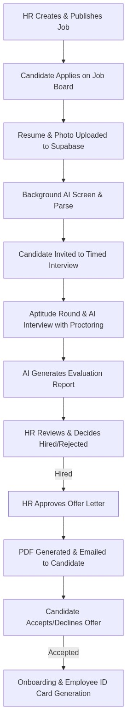

# RIMS (Recruit Intelligence Management System) Workflow Presentation

This document outlines the step-by-step workflow of the RIMS platform. It describes how the system handles job postings, candidate applications, automated AI screening, security-proctored interviews, offer letter generation, and onboarding.

---

## Workflow Overview Diagram

---

## Step-by-Step Workflow

### 1. Job Creation and Configuration (HR)

- **Creating a Job:** An HR user logs into the dashboard and creates a new job posting. They enter details such as job title, description, domain, location, and required experience level.
- **Setting Interview Rules:** HR configures what evaluations the candidate must pass:
  - **Aptitude Round:** Toggle multiple-choice question tests (sourced from a database repository or uploaded file).
  - **AI Interview:** Toggle technical and behavioral rounds, select specific question sets, and define the session duration.
- **Publishing:** The job status is set to "open," making it visible on the public job board.

### 2. Candidate Application Submission (Candidate)

- **Finding the Job:** Candidates browse the public job board and select a job to apply.
- **Submitting Details:** The candidate fills out a form with their name, email, phone number, and uploads their resume (PDF or DOCX format) along with an optional profile photo.
- **Security & Input Validation:** The backend performs checks:
  - Verifies that the candidate has not already applied to this job (checks for duplicate emails, phone numbers, or identical resume file hashes).
  - Validates file size (max 5MB) and checks file headers (magic bytes) to ensure files are not corrupted or malicious.
- **Database & Storage Save:** If validated, a candidate record is created in the database, the resume and photo are uploaded to private Supabase storage buckets, and a confirmation email is queued.

### 3. Background AI Parsing and Screening (System)

- **Text Extraction:** Immediately after submission, a background job downloads the resume and extracts its raw text.
- **AI Evaluation (via Groq API):** The system passes the resume text to an AI model. The AI parses the resume to extract the candidate's name, email, phone, years of experience, education, skills, and roles.
- **Match Scoring:** The AI evaluates how well the resume matches the job requirements and generates a match score (out of 10) and a brief reasoning.
- **Screening Update:** The candidate's status advances to "Resume Screening." If the resume is blank or unreadable, the system flags it as degraded/failed for HR review.

### 4. Timed Online Interview & Proctoring (Candidate)

- **Accessing the Portal:** Shortlisted candidates receive a secure link to the interview portal.
- **Aptitude Test:** If enabled, the candidate answers the multiple-choice questions within a time limit.
- **AI Interview (Technical/Behavioral):** The candidate answers open-ended questions. They can type answers or speak them aloud (voice is transcribed using AI in the background).
- **Security & Proctoring:** To prevent cheating, the frontend proctoring system monitors:
  - Browser tab switching or exiting fullscreen mode.
  - Webcam feed monitoring (captures image snapshots if a face is missing, if there are multiple faces, or if focus is lost).
  - Proctoring violations automatically flag the session or terminate the interview for security.

### 5. AI Report Generation and HR Review (System & HR)

- **Report Generation:** As soon as the interview is completed or the timer runs out, a background task generates a comprehensive report compiling the candidate's scores, answers, transcripts, and proctoring logs.
- **HR Evaluation:** HR reviews the candidate's dashboard page to inspect:
  - Cumulative score and recommendation level.
  - Individual answers and communication analysis.
  - Proctoring logs and captured snapshots.
  - Playback link for the webcam video recording.
- **Decision:** HR updates the candidate stage to either **Hired** or **Rejected**.

### 6. Offer Letter Approval Pipeline (HR)

- **Requesting the Offer:** For hired candidates, HR selects a joining date and salary, then clicks **Issue Offer Letter**.
- **Template Freeze:** The system takes an immutable snapshot of the current HTML offer letter template to ensure future changes do not alter this contract.
- **PDF Contract Generation:** Upon approval, the system uses a headless rendering engine (Puppeteer) to convert the HTML offer snapshot into a secure PDF document and stores it in Supabase.
- **Candidate Notification:** The system automatically emails the PDF contract to the candidate along with a unique link.

### 7. Offer Acceptance & Legal Recording (Candidate)

- **Reviewing the Contract:** The candidate opens the secure link, reviews the offer contract details, and clicks **Accept** or **Decline**.
- **Audit Logging:** To ensure legal validity, the system records the candidate's decision, IP address, user-agent details, and timestamp.
- **Status Transition:** The dashboard transitions the candidate's status to **Offer Accepted** or **Offer Declined**.

### 8. Employee Onboarding & ID Card Generation (HR)

- **Joining Date Transition:** On the scheduled joining date, the candidate is automatically moved to the **Onboarded** stage.
- **Photo Capture:** HR captures the employee's official photo using the camera portal, uploading it to Supabase.
- **Employee ID & ID Card:** The system automatically assigns a unique Employee ID and generates a PDF ID card containing their photo, role, and department. The card is stored in Supabase and is ready to be printed.
